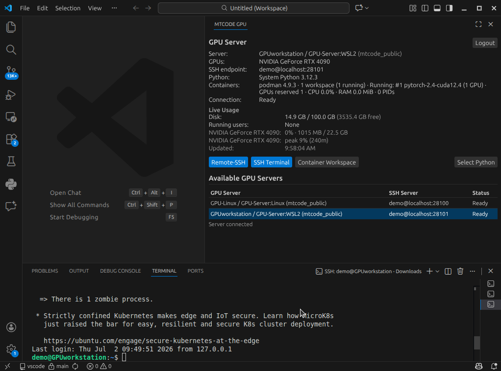
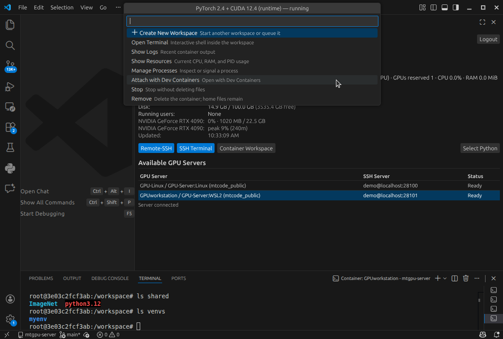
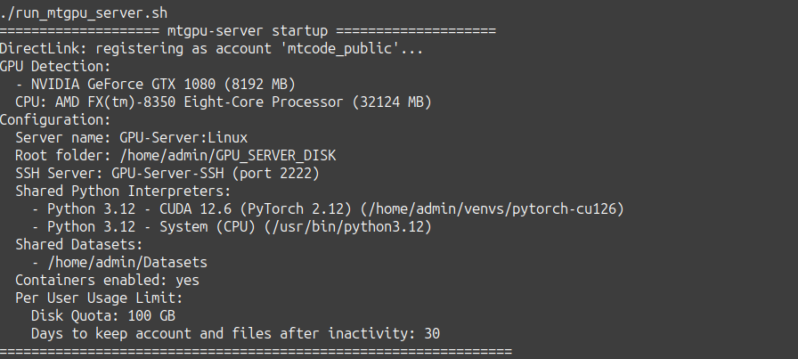

# Remote GPU

Share your team's GPU computers safely — isolated accounts, shared datasets and Python environments, one-click SSH and container workspaces — all managed from a single panel in VS Code.

The **Remote GPU** extension by MTCode is the client for [MTGPU Server](https://mtcodeai.com/platform/gpu-server.html), which runs on your GPU hosts. Together they turn GPU workstations and servers into a shared, multi-tenant development service: the server provisions accounts, resources, and workspaces, while the extension gives every developer one-click access from a familiar editor.

*The panel showing the list of available GPU servers, the selected server's details, live disk/GPU usage, and the **Remote-SSH** / **SSH Terminal** / **Container Workspace** / **Select Python** action buttons.*

## One Interface for Every GPU Server

Sign in once and the panel lists every GPU server you are authorized to use — even when they belong to different administrators.

- **Compare before you connect** — see each server's identity, GPU hardware, connection status, disk usage, and live utilization side by side, then pick the right host.
- **Switch without re-configuring** — move between hosts without hand-editing SSH config. The extension manages endpoints, keys, and port forwards for you.
- **Work on several at once** — keep independent Remote-SSH windows and terminals open across multiple GPU computers for different projects or workloads.

Authorized users reach the host through MTCode DirectLink even when it sits behind NAT or inside a private network — see [How DirectLink Works](https://mtcodeai.com/platform/platform.html).

## One-Click Access

The extension creates an SSH key pair on your computer and the server installs the public key for your tenant account — access is **key-based and ready on the first click**, with no manual key exchange.

- **SSH Terminal** — open an integrated terminal connected to your tenant account on the GPU host, with the registered key and mapped endpoint already wired up.
- **Remote-SSH** — one click opens a full VS Code Remote-SSH window on the GPU host. Standard SSH and Remote-SSH keep their normal encryption and authentication; edit, run, and debug as if local.
- **Dev Containers** — attach a VS Code Dev Containers window directly to a running container workspace to browse files, use terminals, and debug inside the container environment.
- **Select Python** — switch between the ready-made Python / CUDA environments the administrator has published on the host.

## Multi-Tenant by Design — Sharing Without Exposure

A team can share one GPU computer without sharing each other's data. On first connection, the server automatically creates a dedicated, **non-privileged operating-system account** for each authorized user — no manual `useradd`, key copying, or permission tuning.

- A private home directory per tenant, owned by that tenant; one user's files and installed packages stay invisible to every other user.
- Accounts are non-privileged, so tenants cannot reach other tenants or restricted system resources.
- SSH-key-only login through a dedicated OpenSSH service; the OS password is locked by default.
- Configurable per-user disk and GPU usage limits, plus runtime GPU reservation for container workspaces.

## Shared Datasets and Python Environments

GPU development environments and datasets can consume hundreds of gigabytes. Administrators declare them once and every tenant gets ready-to-use access — nothing large is duplicated per user.

- Large datasets are published read-only, available to every tenant at `~/shared/<name>` (and mounted read-only inside managed containers).
- Multiple ready-made Python / CUDA interpreters; users switch with **Select Python** or `mt-python use`.
- Shared packages stay read-only; a normal `pip install` goes into each user's private venv.

## Container Workspaces, Jobs, and Queuing

When a project needs a reproducible or specialized environment, administrators can enable managed container workspaces. Everything is driven from the panel or the `mt-container` command — the GPU server handles the container engine, GPU wiring, and lifecycle.

- Build workspaces from approved templates, custom images, or `devcontainer.json`.
- Reserve specific GPUs and publish ports for Jupyter, TensorBoard, or web UIs.
- Start, stop, rebuild, open shells, inspect logs, and commit a customized image for reuse.
- Launch detached jobs that keep running without an open terminal; when the requested GPUs are busy, jobs and workspaces queue and are admitted by priority.

*A running container workspace: clicking **Container Workspace** opens a menu with actions such as **Open Terminal** / **Attach With Dev Containers**.*

## Getting Started

1. Install this extension in VS Code (or MTCode Studio).
2. Ask your administrator for an MTCode account authorized on their GPU server, or set up [MTGPU Server](https://mtcodeai.com/platform/gpu-server.html) on your own GPU host.
3. Open the **Remote GPU** view in the Activity Bar and sign in.
4. Pick a server from the list — your tenant account and SSH key are provisioned automatically — then click **Remote-SSH**, **SSH Terminal**, or **Container Workspace**.

On the host side, MTGPU Server loads shared datasets, Python environments, quotas, and container settings from a single `config.json`:

## Requirements

- **Client:** VS Code 1.74+ on Windows, macOS, or Linux. The [Remote-SSH](https://marketplace.visualstudio.com/items?itemName=ms-vscode-remote.remote-ssh) extension is used for full remote windows, and [Dev Containers](https://marketplace.visualstudio.com/items?itemName=ms-vscode-remote.remote-containers) for attaching to container workspaces (the extension offers to install them when needed).
- **Host:** MTGPU Server on Linux or WSL2 (including powerful Windows GPU PCs via WSL2); native Windows and macOS are planned with reduced GPU-specific functionality. GPU monitoring supports multiple vendors where host tools are available; CUDA-specific Python and container workflows require NVIDIA-compatible stacks.

## Learn More

- [MTGPU Server — full product overview](https://mtcodeai.com/platform/gpu-server.html)
- [How MTCode DirectLink works](https://mtcodeai.com/platform/platform.html)
- [MTCodeAI.com](https://mtcodeai.com)

---

© 2026 BrightTime Technologies, Inc. All rights reserved.
